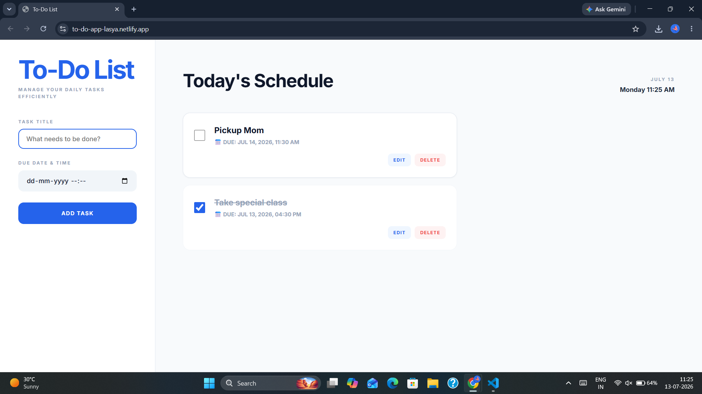

# To-Do Web Application

A clean and responsive To-Do Web Application built using **HTML**, **CSS**, and **JavaScript** to help users organize and manage daily tasks.

## Features

* Add new tasks
* Edit existing tasks
* Mark tasks as completed
* Delete tasks
* Responsive design
* Clean and intuitive interface

## Technologies Used

* HTML5
* CSS3
* JavaScript

## Preview



## Live Demo

https://to-do-app-lasya.netlify.app/

## Project Structure

```text
SCT_WD_4/
├── images/
│   └── preview.png
├── index.html
├── style.css
├── script.js
└── README.md
```

## Run the Project

Download or clone the repository and open `index.html` in your browser.

---

Developed as part of the **SkillCraft Technology Web Development Internship**.
